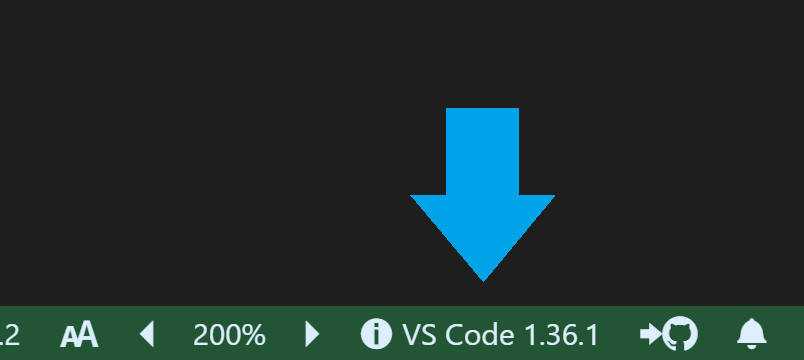

# システム情報 README ( [🇬🇧 English](https://github.com/wraith13/sysinfo-vscode/blob/master/README.md) )

VS Code のシステム情報(拡張一覧を含む)を markdown あるいは JSON で表示します。

## 機能

`System Information: Show` コマンドで VS Code のシステム情報(拡張一覧を含む)を markdown あるいは JSON で表示します。


また、ステータスバーでカスタマイズ可能な情報を表示します。



## チュートリアル

### 0. ⬇️ システム情報拡張のインストール

VS Code の拡張サイドバーを出して(Mac:<kbd>Command</kbd>+<kbd>Shift</kbd>+<kbd>X</kbd>, Windows and Linux: <kbd>Ctrl</kbd>+<kbd>Shift</kbd>+<kbd>X</kbd>)、 `sysinfo-vscode` とタイプし <kbd>Enter</kbd> キーを押下し、<kbd>インストール</kbd> をクリックします。インストールが終わったら VS Code を再起動してください。

### 1. ✨️ システム情報の表示

コマンドパレットを出して(Mac:<kbd>F1</kbd> or <kbd>Shift</kbd>+<kbd>Command</kbd>+<kbd>P</kbd>, Windows and Linux: <kbd>F1</kbd> or <kbd>Shift</kbd>+<kbd>Ctrl</kbd>+<kbd>P</kbd>)、 `System Information: Show` コマンドを実行し、あなたの好きなオプションを選択します。

### 2. 🔧 次のステップ

`settings.json` で システム情報 の[設定](#拡張の設定)を変更できます。

### コマンドリスト

* `System Information: Show` : システム情報を表示します
* `System Information: Show Schema` : VS Code の各種スキーマを表示します
* `System Information: Copy Status bar Text` : ステータスバーテキストをコピーします
* `System Information: Switch Status bar Label` : ステータスバーラベルを切り替えます

## 拡張の設定

[`settings.json`](https://code.visualstudio.com/docs/customization/userandworkspace#_creating-user-and-workspace-settings)( Mac: <kbd>Command</kbd>+<kbd>,</kbd>, Windows / Linux: <kbd>ファイル</kbd> → <kbd>基本設定</kbd> → <kbd>設定</kbd> ) で次の設定ができます。

* `sysinfo.enabledStatusBar`: ステータスバー項目の有効/無効
* `sysinfo.statusBarLabel`: ステータスバー項目のラベル ( 配列で複数指定する事もできます。 )
* `sysinfo.statusBarSwitchInterval`: ステータスバー項目の切り替え間隔(ms)
* `sysinfo.statusBarCommand`: ステータスバー項目のクリックコマンド ( 他のコマンドも設定できますが、 "sysinfo-vscode.switchStatusBarLabel" あるいは "sysinfo-vscode.copyStatusBarText" が設定される事を前提としています。 )
* `sysinfo.hideItems`: 隠す項目の一覧を設定します

指定した項目を隠すことができます。下のサンプルを参照してください。

```json
"sysinfo.hideItems": [
    "timestamp",
    "provider",
    "warnings.W001",
    "vscode.env",
    "vscode.extensions.*.packageJSON.description"
]
```

次の構文でラベルのテキストにはアイコンを埋め込む事ができます。

` $(アイコンの名前) こんな感じで私のテキスト $(icon-name) はアイコンを含める事ができます。`

icon-name は [codicons](https://microsoft.github.io/vscode-codicons/dist/codicon.html) のアイコンセットから選びます。例： `light-bulb`, `thumbsup`, `zap` etc.

あなたは UNICODE 文字 ( 絵文字を含む )をラベルのテキストに指定することもできます。

### `sysinfo.statusBarLabel` 設定サンプル

* `$(info) VS Code ${vscode.version}` ( default )
* `$(info) ${vscode.env.appName} ${vscode.version} ${vscode.env.language} ${process.execArgv}`
* `$(device-desktop) ${os.hostname}`
* `$(symbol-color) ${settings:workbench.colorTheme}`
* `$(text-size) ${settings:editor.fontSize}`

配列で複数指定する事もできます。

## リリースノート

[marketplace](https://marketplace.visualstudio.com/items/wraith13.sysinfo-vscode/changelog) あるいは [github](https://github.com/wraith13/sysinfo-vscode/blob/master/CHANGELOG.md) の ChangLog を参照してください。

## サポート

[GitHub Issues](https://github.com/wraith13/sysinfo-vscode/issues)

## ライセンス

[Boost Software License](https://github.com/wraith13/sysinfo-vscode/blob/master/LICENSE_1_0.txt)
