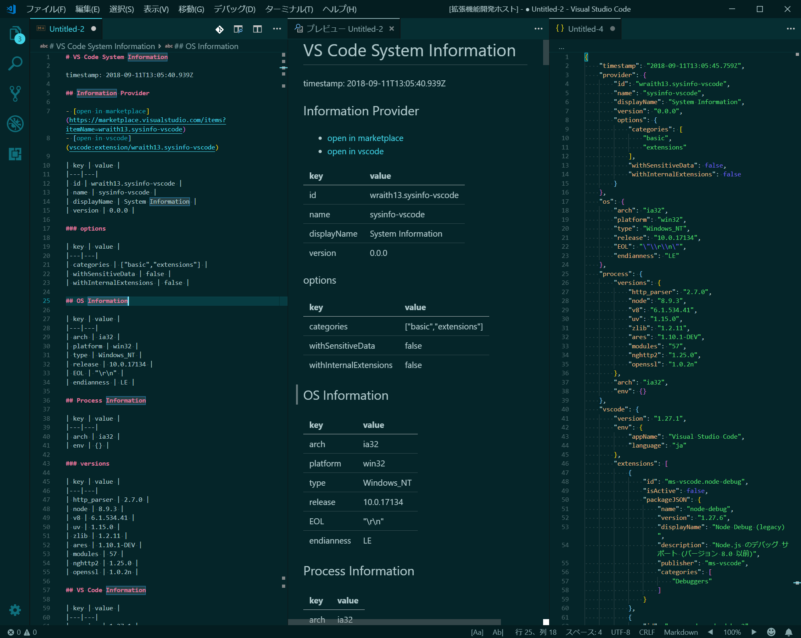

# System Information README

This Visual Studio Code extension shows system information by markdown format.

## Features

Can zoom via GUI in status bar.

> System Information changes only `window.zoomLevel`, does not change editor font zoom.

## Tutorial

### 0. ⬇️ Install System Information

Show extension side bar within VS Code(Mac:<kbd>Command</kbd>+<kbd>Shift</kbd>+<kbd>X</kbd>, Windows and Linux: <kbd>Ctrl</kbd>+<kbd>Shift</kbd>+<kbd>X</kbd>), type `sysinfo-vscode` and press <kbd>Enter</kbd> and click <kbd>Install</kbd>. Restart VS Code when installation is completed.

### 1. 🔍 Zooming via GUI

Click `-` to zoom out, click `+` to zoom in. And click zoom percentage to show zoom menu.

Enjoy!

## Commands

* `System Information: Select Zoom` : zoom by preset or input
* `System Information: Reset Zoom` : reset zoom
* `System Information: Zoom In` : zoom in
* `System Information: Zoom Out` : zoom out

## Release Notes

see ChangLog on [marketplace](https://marketplace.visualstudio.com/items/wraith13.sysinfo-vscode/changelog) or [github](https://github.com/wraith13/sysinfo-vscode/blob/master/CHANGELOG.md)

## Support

[GitHub Issues](https://github.com/wraith13/sysinfo-vscode/issues)

## License

[Boost Software License](https://github.com/wraith13/sysinfo-vscode/blob/master/LICENSE_1_0.txt)
